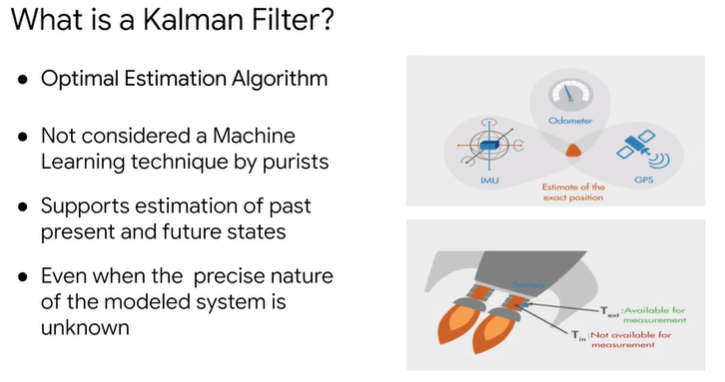
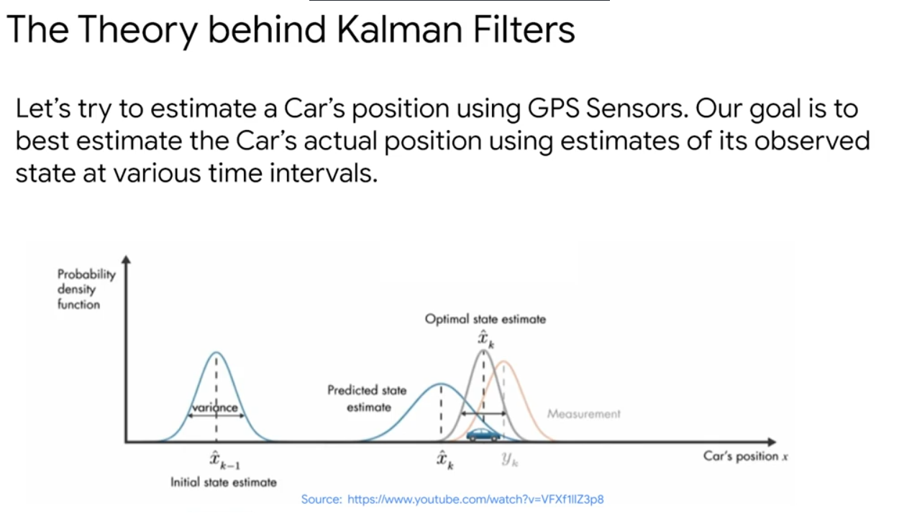
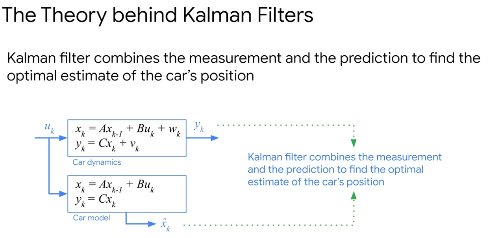
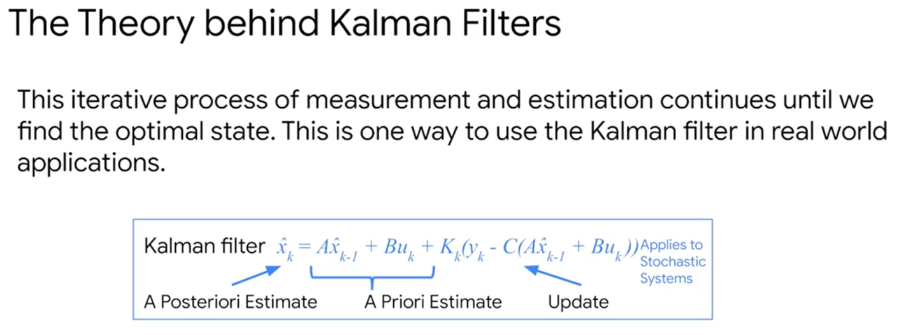

It provides an efficient way to estimate the state of a process.  Kalman filter does this in a way that minimizes the mean of the squared error. 

 A Kalman filter is needed when the variables of interest can be measured only indirectly or measurements that are available from multiple sources subject to Noise. 

  Given a sequence of noisy measurements, the Kalman Filter is able to recover the true state of the underlying object being tracked.

   A Kalman Filter combines measurement and prediction to find an optimum estimate of the target value

    Given a sequence of noisy measurements as you can see in the rocket boosters shield, the Kalman filter is able to discover the true temperature of the exhaust pathway by using the sensor measurement and applying a continuous, recursive series of two steps. The first step is the time update step, which predicts, or you can say guesses, the current state estimate using the shield sensor's reading ahead in time. The second step is the measurement update which adjusts the projected estimate by an actual measurement at that time. By this constant estimation correction cycle, you can imagine how this series will eventually stabilize around the actual value or at least close to the temperature in the exhaust. Thus you can see that the Kalman filter combines measurement and prediction to find an optimal estimate of the target value

